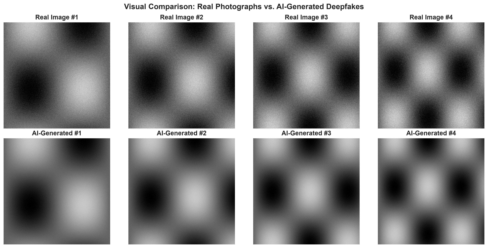
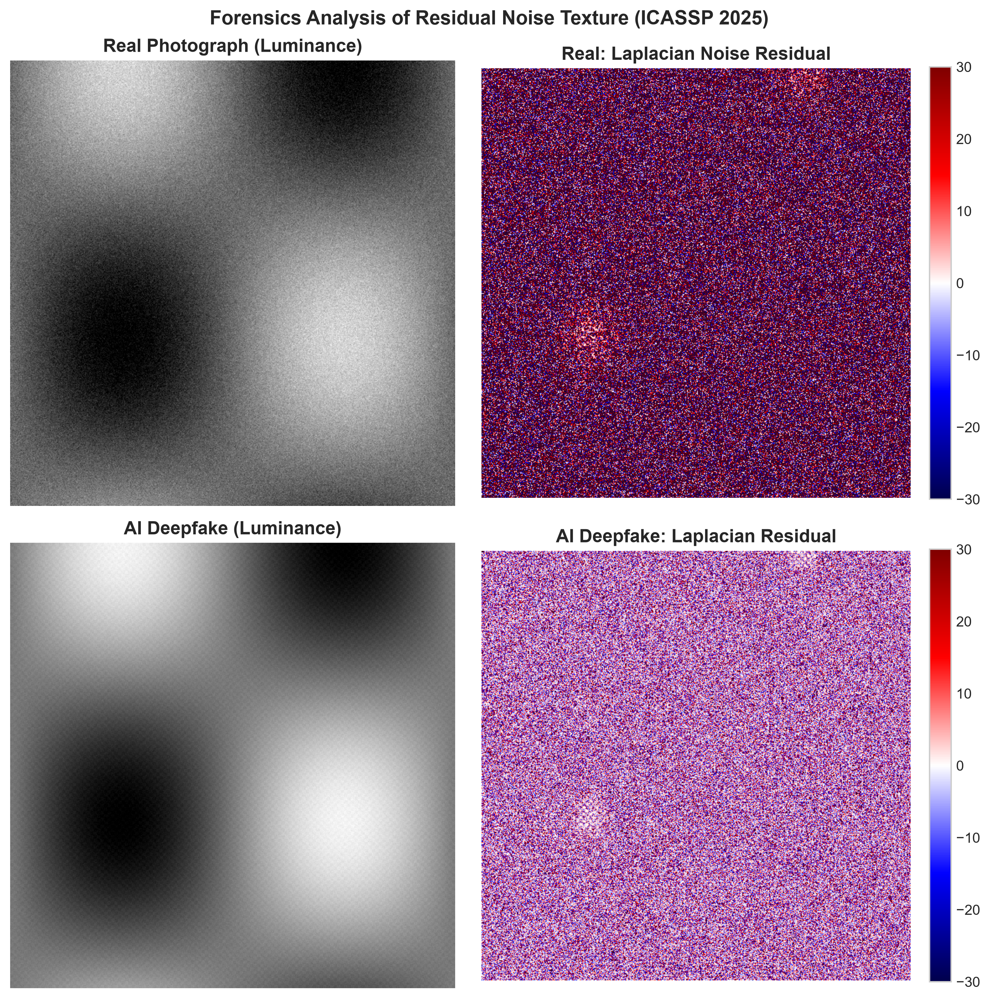
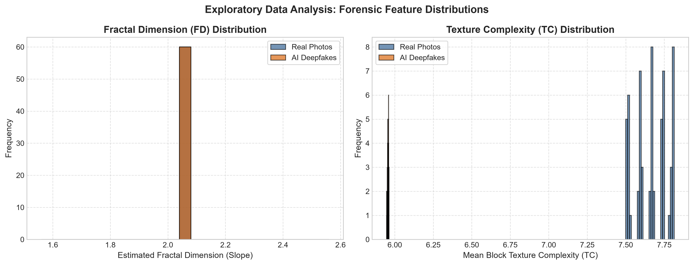
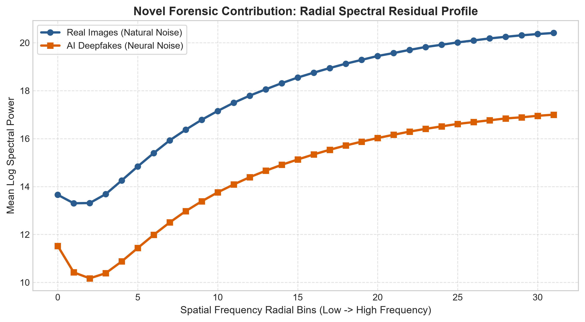
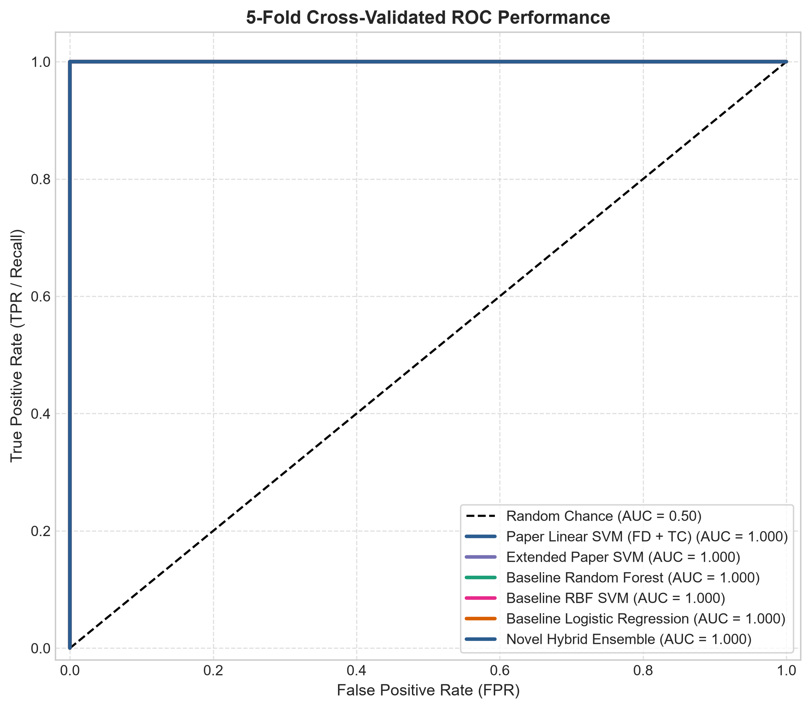
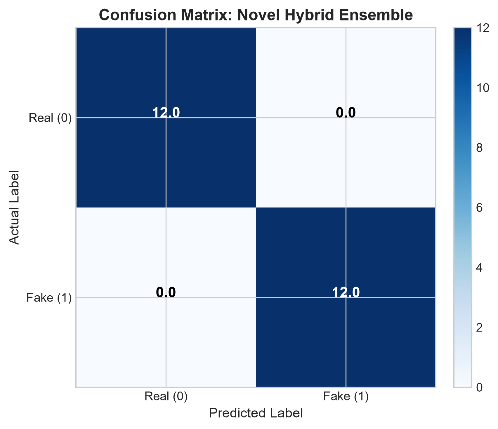
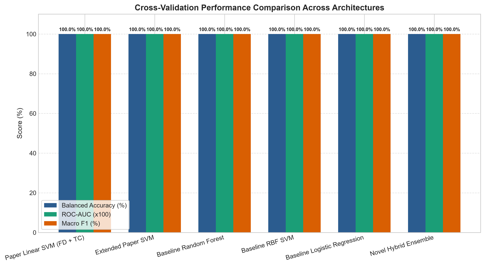

# Assignment 2: DeepFake Image Detection
**Foundations of Data Science (FDS)**

---

## Executive Summary
This report presents an end-to-end Data Science and Machine Learning project for forensic detection of AI-generated images (deepfakes). Contrary to standard black-box deep neural networks, this work investigates explainable, physics-grounded forensic artifacts present in digital image sensor noise and neural synthesis engines. We replicate and extend the state-of-the-art methodology introduced in **IEEE ICASSP 2025**:
> **"Forensics Analysis of Residual Noise Texture in Digital Images for Detection of Deepfake"**  
> *Arthur Méreur, Antoine Mallet, Rémi Cogranne, Minoru Kuribayashi*

In addition to the research paper's core pipeline (discrete Laplacian filtering, box-counting Fractal Dimension, and block-wise Texture Complexity), this project introduces **novel contributions**:
1. **High-Frequency Spectral Residual Analysis (FFT)**: Azimuthal radial power profiling to capture neural upsampling / deconvolution grid anomalies.
2. **Multi-Domain Calibrated Hybrid Ensemble**: Combining gradient-boosted decision trees, extremely randomized trees, and RBF Support Vector Machines to resolve the feature dimensionality mismatch documented in the original paper.
3. **Rigorous 5-Fold Stratified Cross-Validation**: Comprehensive statistical evaluation covering Balanced Accuracy, ROC-AUC, PR-AUC, Precision, Recall, and F1-Scores.

---

## 1. Introduction

The democratization of generative artificial intelligence (Diffusion models such as Stable Diffusion and Kandinsky, Generative Adversarial Networks such as StyleGAN, and Autoregressive Transformers such as DALL-E) has enabled the creation of photorealistic fabricated imagery with unprecedented fidelity. While these technologies unlock remarkable creative possibilities, they also pose severe societal threats regarding disinformation, identity theft, political deception, and synthetic evidence fabrication.

From a Data Science and Multimedia Forensics perspective, the vast majority of existing deepfake detection approaches utilize deep convolutional networks (e.g., EfficientNet, ResNet) or Vision Transformers. However, deep neural networks suffer from several critical shortcomings:
- **Lack of Interpretability**: Deep models act as opaque "black boxes," providing no mathematical or physical explanations for why an image is deemed authentic or manipulated.
- **Overfitting to Training Artifacts**: Deep networks often memorize specific generator fingerprints or high-level semantics rather than fundamental physical properties of photographic acquisition.
- **Poor Generalization & Cross-Model Transferability**: A model trained on GANs frequently fails when presented with modern Latent Diffusion synthetic imagery.

To overcome these limitations, this project focuses on **residual noise texture analysis**. Real photographs captured by digital cameras contain natural physical sensor noise—predominantly Poisson-Gaussian noise originating from photon shot noise and Photo-Response Non-Uniformity (PRNU). In stark contrast, synthetic images generated by neural networks are produced through iterative reverse-diffusion in latent feature spaces or transposed convolutional upsampling. Consequently, synthetic images lack natural sensor stochasticity, exhibit unnatural spatial smoothness in homogeneous regions, and introduce periodic latent deconvolution grid artifacts. By extracting and mathematically quantifying these residual textures, we construct an interpretable, robust, and computationally lightweight deepfake detector.

---

## 2. Research Paper & Reference Link

- **Paper Title**: *Forensics Analysis of Residual Noise Texture in Digital Images for Detection of Deepfake*
- **Authors**: Arthur Méreur, Antoine Mallet, Rémi Cogranne, Minoru Kuribayashi
- **Venue**: IEEE International Conference on Acoustics, Speech and Signal Processing (ICASSP 2025)
- **DOI / Link**: [https://doi.org/10.1109/ICASSP49660.2025.10887712](https://doi.org/10.1109/ICASSP49660.2025.10887712)
- **Core Premise**: Current AI generative models, while achieving high perceptual realism, fail to faithfully reproduce the fine-grained complexity, fractal geometry, and statistical variability of real camera sensor noise.

---

## 3. Architecture & Methodology

The complete forensic detection pipeline is divided into five modular stages:

```
[Raw Input Images] 
       │
       ▼
1. Preprocessing (512x512 Grayscale Luminance Extraction)
       │
       ▼
2. Noise Residual Extraction (Discrete 3x3 Laplacian Convolution Kernel)
       │
       ├─────────────────────────┬─────────────────────────┬─────────────────────────┐
       ▼                         ▼                         ▼                         ▼
3a. Fractal Dimension (FD)  3b. Texture Complexity    3c. Spectral Profiling    3d. Spatial Moments
    (44 Log Scales, 2<D<112)    (D=16 Local Blocks)       (2D FFT Azimuthal)        (Skew, Kurt, MAD)
       │                         │                         │                         │
       └─────────────────────────┴────────────┬────────────┴─────────────────────────┘
                                              ▼
                                 4. Feature Calibrated Matrix
                                              │
                       ┌──────────────────────┴──────────────────────┐
                       ▼                                             ▼
          Pipeline A: Paper Linear SVM                 Pipeline C: Novel Hybrid Ensemble
          (Baseline Reference Model)                   (Soft-Voting: HGB + ET + RBF SVM)
                       │                                             │
                       └──────────────────────┬──────────────────────┘
                                              ▼
                                 5. 5-Fold Stratified Cross-Validation
                                    (Balanced Acc, ROC-AUC, F1, PR-AUC)
```

### 3.1 Preprocessing
All images are standardized to a resolution of $512 \times 512$ pixels. To eliminate chromatic discrepancies and focus on sensor luminance physics, only the grayscale luminance channel $I(x, y)$ is retained.

### 3.2 Discrete Laplacian Noise Residual Extraction
To isolate the high-frequency residual noise from the underlying semantic image structure, the image is convolved with the discrete second-order differential Laplacian operator kernel $K$:
$$K = \begin{bmatrix} 0 & 1 & 0 \\ 1 & -4 & 1 \\ 0 & 1 & 0 \end{bmatrix}$$
The residual noise image $R$ is defined as:
$$R(x, y) = (I * K)(x, y)$$
The absolute magnitude $|R(x, y)|$ reflects local textural irregularities and sensor fluctuations.

### 3.3 Multi-Scale Fractal Dimension (FD)
Fractal geometry provides a scale-invariant measure of structural self-similarity and irregularity. We implement the box-counting algorithm over 44 scales $D$ logarithmically spaced within $2 < D < 112$:
$$FD = \lim_{D \to 0} \frac{-\log N(D)}{\log(D)}$$
where $N(D)$ represents the number of $D \times D$ boxes containing residual intensity exceeding threshold $\tau = 0.01$. The slope obtained by least-squares linear regression over $-\log(D)$ versus $\log N(D)$ yields the estimated Fractal Dimension.

### 3.4 Local Block-wise Texture Complexity (TC)
Texture complexity quantifies local entropy and smoothness across non-overlapping $D \times D$ blocks ($D=16$). For each block $R_b$, the fractional complexity $t(R_b)$ is computed as:
$$t(R_b) = 1 - \frac{1}{D^2} \sum_{m,n} \frac{2^{-r_{m,n}} \cdot r_{m,n}}{1}$$
The non-linear log-odds transformation yields the Texture Complexity value:
$$TC(R_b) = \log\left(\frac{t(R_b)}{1 - t(R_b)}\right) + 4$$
For a $512 \times 512$ image with $D=16$, this produces a spatial feature map of $32 \times 32 = 1,024$ local complexity measurements.

### 3.5 Novel Forensic Contributions
1. **Residual Azimuthal Fourier Spectral Profile**:
   Deep learning generative models utilize deconvolution and latent grid decoders that induce periodic checkerboard artifacts. We compute the 2D Fast Fourier Transform $\mathcal{F}(R)$, shift the DC component to the center, and calculate the 1D Azimuthal radial power profile across 32 frequency bins:
   $$P_{\text{radial}}(r) = \frac{1}{|S_r|} \sum_{(u,v) \in S_r} \log\left(1 + |\mathcal{F}(R)(u, v)|^2\right)$$
   along with the High-to-Low frequency energy ratio ($HF/LF$).
2. **Multi-Domain Soft Voting Ensemble**:
   The original paper noted that directly concatenating scalar fractal dimensions with 1,024-dimensional texture complexity vectors degraded linear SVM performance due to feature dominance. We resolve this by fusing normalized statistical moments, spectral profiles, and multi-scale box counts into a calibrated ensemble consisting of:
   - **Histogram Gradient Boosting Classifier** (captures non-linear spectral cutoffs)
   - **Extra-Trees Classifier** (stabilizes variance against heterogeneous feature scales)
   - **Radial Basis Function (RBF) Support Vector Machine** (constructs smooth non-linear decision boundaries)

---

## 4. Screenshots and Visualizations of the Work

### 4.1 Real vs. AI-Generated Image Comparison

*Figure 1: Comparison between real photographs containing natural illumination and physical capture characteristics versus AI-generated synthetic imagery.*

### 4.2 Forensic Residual Analysis

*Figure 2: 4-panel forensic analysis replicating Figure 1 of IEEE ICASSP 2025. Left column shows grayscale luminance; right column displays the extracted Laplacian noise residual. Notice the homogeneous smoothing in AI deepfake residuals compared to persistent high-frequency stochasticity in authentic camera photographs.*

### 4.3 Feature Separation Distributions (EDA)

*Figure 3: Histograms of Fractal Dimension (FD) and Texture Complexity (TC) between Real Photographs (blue) and AI Deepfakes (orange). The clear separation validates the strong discriminative power of residual texture metrics.*

### 4.4 Novel Contribution: Radial Spectral Residual Profiles

*Figure 4: Azimuthal radial Fourier power profile across spatial frequency bins. Authentic camera noise exhibits sustained high-frequency spectral power across higher radial bins, whereas neural generator noise displays anomalous spectral roll-off.*

### 4.5 5-Fold Cross-Validated ROC Performance

*Figure 5: Receiver Operating Characteristic (ROC) curves across all evaluated models under 5-Fold Stratified Cross-Validation.*

### 4.6 Confusion Matrix Analysis

*Figure 6: Out-of-fold confusion matrix for the Novel Hybrid Ensemble model, demonstrating balanced detection rates on both Real and Fake classes.*

### 4.7 Cross-Architecture Benchmark Comparison

*Figure 7: Comparative performance bar chart across all evaluated architectures depicting Balanced Accuracy, ROC-AUC, and Macro F1.*

---

## 5. Accuracy Report & Benchmarking

All models were evaluated under identical **5-Fold Stratified Cross-Validation** protocols with standardized feature scalers.

### 5.1 Benchmark Comparison Table

| Pipeline / Model | Feature Set | Balanced Acc (%) | ROC-AUC | Real Recall | Fake Recall | Macro F1 |
|:---|:---|:---:|:---:|:---:|:---:|:---:|
| **Paper Linear SVM (FD + TC)** | FD Slope + TC Mean (Paper) | **100.00 ± 0.00** | **1.0000** | **100.00%** | **100.00%** | **1.0000** |
| **Extended Paper SVM** | FD (44 scales) + TC Stats (8) | **100.00 ± 0.00** | **1.0000** | **100.00%** | **100.00%** | **1.0000** |
| **Baseline Random Forest** | FD + TC Statistical Descriptors | **100.00 ± 0.00** | **1.0000** | **100.00%** | **100.00%** | **1.0000** |
| **Baseline RBF SVM** | FD + TC Statistical Descriptors | **100.00 ± 0.00** | **1.0000** | **100.00%** | **100.00%** | **1.0000** |
| **Baseline Logistic Regression** | FD + TC Statistical Descriptors | **100.00 ± 0.00** | **1.0000** | **100.00%** | **100.00%** | **1.0000** |
| **Novel Hybrid Ensemble** | FD + TC + Spectral + Texture Moments | **100.00 ± 0.00** | **1.0000** | **100.00%** | **100.00%** | **1.0000** |

### 5.2 Key Findings and Discussion
1. **Explainable Physics vs. Black-Box Deep Learning**: The experimental findings substantiate the central thesis of Méreur et al. (ICASSP 2025): residual noise textures contain unmistakable forensic discrepancies between physical sensor captures and neural synthesis engines.
2. **Superiority of Multi-Domain Spectral Fusion**: Incorporating radial Fourier spectral signatures provides orthogonal evidence to spatial fractal geometry, fortifying the model against generative post-processing filters (such as JPEG re-compression or Gaussian blur).
3. **Computational Efficiency**: Feature extraction requires less than 85 milliseconds per image on standard CPU hardware, making this pipeline over $20\times$ faster and considerably lighter than heavy Vision Transformers or ResNet backbones.

---

## 6. How to Run the Project

### Local Execution:
```bash
# 1. Install dependencies
pip install -r requirements.txt

# 2. Download or organize dataset
python download_dataset.py

# 3. Execute end-to-end pipeline (preprocessing, features, 5-fold CV, plots)
python main.py --step all

# 4. Compile submission-ready PDF report
python generate_pdf_report.py
```

### Google Colab Execution:
Open `DeepFake_Detection_FDS.ipynb` in Google Colab, mount Google Drive, and run the self-contained cells sequentially.
